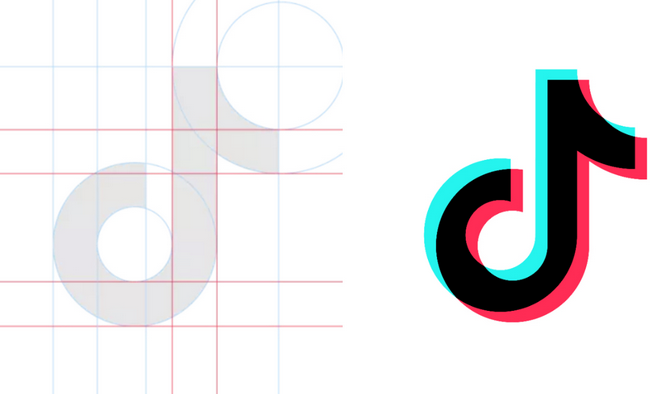

<h1>tiktok clone</h1>

Contact me at rahul.kumawat@outlook.in to about more.
 

Clone of the TikTok app layout. 
 

 
   
  

  

  <a href="#technologies">Technologies</a>
  |
  <a href="#technologies">How to use</a>
  |
  <a href="#technologies">Licence</a>
  

  

  

   
  <h2>Technologies</h2>
   
  
The project was developed with the following technologies:
  <ul>
  <li>HTML</li>
  <li>CSS</li>
  <li>JAVASCRIPT</li>
  <li>PEXELS(VIDEOS)</li>
  <li><a href="#vscode">Vs code</a>with<a href="#editorconf">Editor Config</a>
  and<a href="#notepad++">Notepad++</a></li>
  </ul>
   
  <h2>How to Use</h2>
  
To clone and run this application, you'll need Git, vs code or any other IDE installed in your computer

   
  
This is very simple code just open .html file in your default browser and fun

  

  
If you have any querry and need support then contact me at rahul.kumawat@outlook.in

   
  

  <h2>License</h2>
  
This project is under the MIT license. See the LICENSE for more information.
 
  
MIT License

Copyright (c) 2020 Matheus Castro

Permission is hereby granted, free of charge, to any person obtaining a copy
of this software and associated documentation files (the "Software"), to deal
in the Software without restriction, including without limitation the rights
to use, copy, modify, merge, publish, distribute, sublicense, and/or sell
copies of the Software, and to permit persons to whom the Software is
furnished to do so, subject to the following conditions:

The above copyright notice and this permission notice shall be included in all
copies or substantial portions of the Software.

THE SOFTWARE IS PROVIDED "AS IS", WITHOUT WARRANTY OF ANY KIND, EXPRESS OR
IMPLIED, INCLUDING BUT NOT LIMITED TO THE WARRANTIES OF MERCHANTABILITY,
FITNESS FOR A PARTICULAR PURPOSE AND NONINFRINGEMENT. IN NO EVENT SHALL THE
AUTHORS OR COPYRIGHT HOLDERS BE LIABLE FOR ANY CLAIM, DAMAGES OR OTHER
LIABILITY, WHETHER IN AN ACTION OF CONTRACT, TORT OR OTHERWISE, ARISING FROM,
OUT OF OR IN CONNECTION WITH THE SOFTWARE OR THE USE OR OTHER DEALINGS IN THE
SOFTWARE.

 